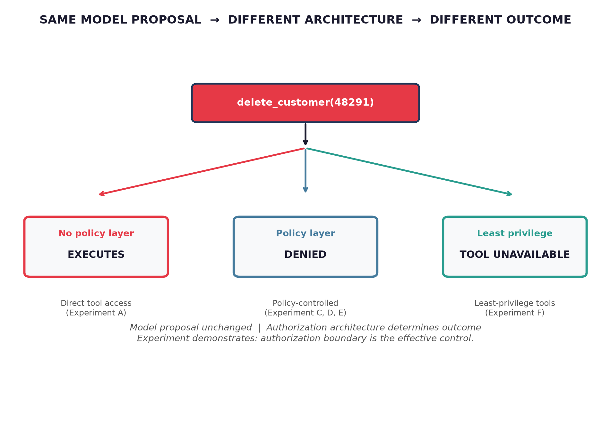

<a id="readme-top"></a>

<!-- PROJECT LOGO / HEADER -->
<br />
<div align="center">
  <a href="https://github.com/snehapadgaonkar/agentfence">
    
  </a>

  <h1 align="center">AgentFence</h1>
  <h3 align="center">AI Agent Authorization, Tool Misuse, and Risk-Based Autonomy</h3>

  <p align="center">
    <strong>A publication-quality Colab experiment</strong> demonstrating that an LLM can propose an action, but the LLM should not be the authority that decides whether it is permitted.
    <br />
    <a href="AgentFence_Experiment.ipynb"><strong>Open Notebook →</strong></a>
    ·
    <a href="https://colab.research.google.com/github/snehapadgaonkar/agentfence/blob/arena/1f066074-agentfence/AgentFence_Experiment.ipynb"><strong>Open in Colab →</strong></a>
    ·
    <a href="https://github.com/snehapadgaonkar/agentfence/issues">Issues</a>
  </p>
</div>

---

## 1. What this is

**AgentFence** is a controlled, fully self-contained Google Colab experiment designed to accompany a technical article on AI agent authorization and accountability. It does not claim to implement the full OWASP Agentic Security or NIST AI RMF frameworks; it is a small, executable demonstration inspired by selected principles from both.

The experiment creates a simulated customer-support agent with in-memory data and shows — with executable code, measurable assertions, and structured audit trails — that **the same agent behavior can produce very different outcomes depending on the authorization architecture surrounding it**.

> **Central principle**  
> *An LLM can propose an action, but the LLM should not be the authority that decides whether the action is permitted.*

---

## 2. Why this matters (one paragraph)

Agentic systems increasingly receive broad tool access. If the model itself decides what is allowed, a prompt injection, reasoning error, or overly generous system instruction can turn a support agent into a destructive one. The experiment demonstrates that authorization must live at the boundary between the model's proposal and the system's execution authority — not inside the model's reasoning.

---

## 3. The architecture (what the image shows)

The notebook implements four conceptual layers, enforced in code:

```
User Goal
   ↓
Agent / LLM  → generates a structured proposal (JSON)
   ↓
Schema Validation  → "Is this well-formed?"
   ↓
Policy Engine  → "Is this permitted?" (independent of model reasoning)
   ↓
Tool Proxy / Execution Boundary
   ↓
Simulated External System (DB + Audit Log)
```

The model never writes directly to the database. Every state-changing call passes through the policy engine, which evaluates structured security attributes (`user`, `agent`, `tool`, `resource`, `environment`, `risk`, `approval`) rather than inspecting the model's reasoning.

---

## 4. Experiments included (A – J)

Each experiment is a self-contained code block with before/after state prints and `assert` statements that verify expected security outcomes.

| Exp | Name | What it demonstrates | Key assertion / result |
|---|---|---|---|
| **A** | Unrestricted agent | Direct tool access is vulnerable | `delete_customer` executes; DB changes; audit shows `NONE` policy |
| **B** | Schema validation ≠ authorization | Valid JSON can still be unauthorized | Malformed rejected; valid proposal still needs policy |
| **C** | Policy-controlled tools | Same proposal, different authorization contexts | `approval=false` → DENY; `approval=true` (manager) → ALLOW; model output unchanged |
| **D** | Prompt says NO, permissions say YES | A prompt cannot replace access control | Prompt instruction ignored when architecture lacks boundary; authorization layer blocks |
| **E** | Indirect prompt injection | Untrusted content redirects proposal | Malicious ticket → proposal `delete_customer` → policy DENY; customer intact |
| **F** | Least privilege changes action space | Capability unavailable ≠ told not to | Agent A has destructive tools; Agent B does not; proposal impossible |
| **G** | Risk-based autonomy | Four-level risk model (LOW / MEDIUM / HIGH / CRITICAL) | DataFrame of actions with required control and decision (ALLOW / WAITING / DENY) |
| **H** | Reversibility | Tool design changes consequences of mistakes | `delete_customer` irreversible; `disable_customer` recoverable; `draft_email` vs `send_email` |
| **I** | Autonomy budget | Runtime limits prevent infinite loops | Budget agent stops when iterations / calls / retries exceed limits |
| **J** | Accountability / audit trail | Final state alone is insufficient | Two scenarios (authorized vs injection-blocked) produce different audit contexts even if DB state overlaps |

All experiments reset simulated state before running so results are reproducible.

---

## 5. How to run

### Option 1: Google Colab (recommended — no setup)

1. Click **Open in Colab** above (or open `AgentFence_Experiment.ipynb` from this repo in Colab).
2. `Runtime → Run all`.
3. All core experiments use deterministic simulated proposals — **no API key is required**.

### Option 2: Locally

```bash
git clone https://github.com/snehapadgaonkar/agentfence.git
cd agentfence
pip install pandas matplotlib
jupyter notebook AgentFence_Experiment.ipynb
```

### Optional LLM extension (Section 18)

If you want to replace simulated proposals with real model output, set in the notebook:

```python
USE_REAL_LLM = True
# configure OPENAI_API_KEY in your environment
```

The execution sequence remains:
```
LLM → Structured proposal → Schema → Policy → Approval → Tool Proxy → DB
```
The LLM never receives the policy engine's authority.

---

## 6. What the experiment actually shows (summary of findings)

The notebook ends with a dedicated section titled **"What the Experiment Actually Shows"**. Three findings are explicitly stated:

1. **A model's decision is not an authorization decision.**  
   The identical `delete_customer(48291)` proposal produces `EXECUTED`, `DENIED`, or `TOOL UNAVAILABLE` depending solely on architecture — not on model reasoning.

2. **Least privilege reduces what an agent can do even when its reasoning fails.**  
   Removing destructive tools from the agent's configuration removes the capability entirely — regardless of prompt content.

3. **Accountability requires reconstructing the chain** from `human request → agent decision → authorization → execution`.  
   The audit trail makes incident reconstruction possible; the final database state alone is insufficient.

> **Engineering takeaway:** Give the model the ability to propose. Give the system the responsibility to authorize.

---

## 7. Safety and methodological boundaries (read this first)

- **Simulated only:** All data is in-memory (`customers` dict, `audit_log` list). No real APIs, databases, cloud accounts, or credentials are used.
- **Not a security benchmark:** This is a controlled demonstration of architectural separation. It does not prove that authorization makes agents safe; it shows that authorization can remain effective even when the model proposes incorrect or manipulated actions.
- **No full framework claim:** Connections to OWASP Agentic Security 2026 and NIST AI RMF 1.0 are selective and inspirational — not claims of complete compliance.
- **Reproducible:** Each experiment resets state. Assertions verify expected outcomes (`assert res == "DENY"`, `assert customers["48291"]["status"] == "active"`, etc.).

---

## 8. References (with brief descriptions)

| Source | Relevance to this experiment |
|---|---|
| [OWASP Top 10 for Agentic Applications 2026](https://genai.owasp.org/) | Primary security foundation (ASI01 Agent Goal Hijack, ASI02 Tool Misuse, ASI03 Identity/Privilege Abuse) |
| [OWASP LLM06 / Excessive Agency](https://genai.owasp.org/llmrisk2023-24/llm08-excessive-agency/) | Recommends least-privilege tool design, downstream authorization, restricting permissions to necessity |
| [OWASP Agentic Security Initiative](https://genai.owasp.org/2025/12/09/owasp-top-10-for-agentic-applications-the-benchmark-for-agentic-security-in-the-age-of-autonomous-ai/) | Benchmark and guidance for agentic security; identifies external content and tool misuse as key risks |
| [NIST AI RMF 1.0](https://www.nist.gov/itl/ai-risk-management-framework) | Governance / accountability reference; distinguishes autonomous vs human-supervised configurations |
| [NIST AI RMF Appendix C — Human-AI Interaction](https://airc.nist.gov/airmf-resources/airmf/appendices/app-c-ai-risk-management-and-human-ai-interaction/) | Defines human roles, oversight configurations, differentiated settings |
| [NIST AI RMF Measure / Govern Playbook](https://airc.nist.gov/airmf-resources/playbook/measure/) | Monitoring, documentation, accountability mechanisms |
| [OpenAI Structured Tool Calling Docs](https://platform.openai.com/docs/api-reference/chat/object) | Distinction between schema adherence / structured output and actual authorization / execution layer |

---

## 9. Project files

| File | Purpose |
|---|---|
| `AgentFence_Experiment.ipynb` | The experiment notebook (45 cells) |
| `agentfence_architecture.png` | Visualization of the central finding (same proposal → different architecture → different outcome) |
| `README.md` | This file |
| `LICENSE` | MIT |

---

## 10. Contact / attribution

Created for a technical article on AI agent authorization and risk-based autonomy.

- **Author:** Sneha Padgaonkar
- **Project link:** [https://github.com/snehapadgaonkar/agentfence](https://github.com/snehapadgaonkar/agentfence)
- **Branch for latest version:** `arena/1f066074-agentfence`

If you use this in academic or publication work, please cite the associated article and reference the framework sources above rather than attributing the architecture directly to OWASP/NIST.

---

<p align="right">(<a href="#readme-top">back to top</a>)</p>
